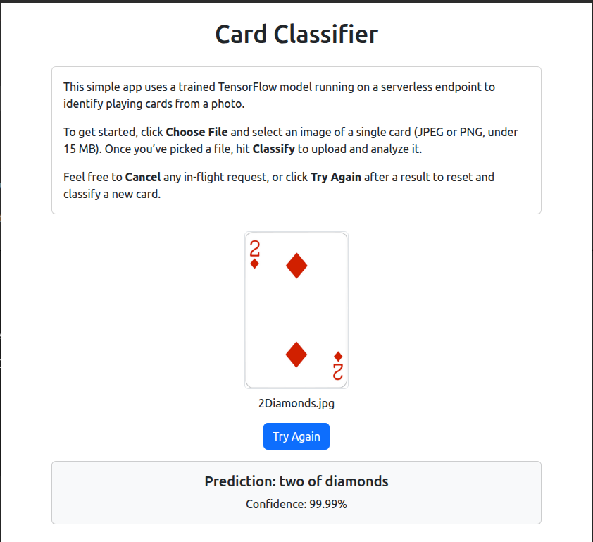

# Card Classifier

A React-based front end for classifying playing cards using a serverless TensorFlow endpoint (AWS Lambda/SageMaker). Upload an image of a single card (JPEG/PNG), click **Classify**, and view the predicted card name and confidence score.

## Features

- **Image upload & preview**: drag-and-drop or file picker, with client-side type/size validation (max 15 MB).
- **OffscreenCanvas resizing**: scales your image to 224 × 224 to match model input and minimize payload.
- **Serverless inference**: sends base64‑encoded PNG to a Lambda/SageMaker endpoint.
- **Abortable requests**: cancel long-running classifications with a built‑in timeout or **Cancel** button.
- **Try Again**: resets the UI for another classification round.
- **Responsive UI**: built with React + react‑bootstrap components.

## Screenshots



## Prerequisites

- Node.js >= 14
- npm or yarn
- A deployed TensorFlow classification endpoint (API Gateway + Lambda/SageMaker)

## Getting Started

1. **Clone the repo**

   ```bash
   git clone https://github.com/<your‑org>/card-classifier-frontend.git
   cd card-classifier-frontend
   ```

2. **Install dependencies**

   ```bash
   npm install
   # or
   yarn install
   ```

3. **Configure your API URL**

   Create a `.env.development.local` file in the root with your endpoint:

   ```bash
   REACT_APP_API_BASE_URL=https://<your-api>.execute-api.<region>.amazonaws.com/dev
   ```

   This file is ignored by Git and overrides any `.env` settings.

4. **Run in development mode**

   ```bash
   npm start
   # or
   yarn start
   ```

   The app will open at `http://localhost:3000`.

5. **Build for production**

   ```bash
   npm run build
   # or
   yarn build
   ```

   Your optimized static files land in `build/`, ready to host on S3, Netlify, GitHub Pages, etc.

## Deploying the Front End

You can host the `build/` folder on any static site service. For example, to deploy to GitHub Pages:

```bash
npm install -g gh-pages
npm run build
gh-pages -d build
```

Or upload `build/` to an S3 bucket and serve via CloudFront.

## Environment Variables

| Variable                 | Description                          |
| ------------------------ | ------------------------------------ |
| `REACT_APP_API_BASE_URL` | Base URL for the prediction endpoint |

## Project Structure

```
src/
├── App.js               # Main component
├── CardClassifier.jsx   # Core UI and logic
├── index.js             # Entry point (CSS imports)
├── index.css            # Global styles
├── App.css              # Component overrides
└── components/          # (optional) shared UI components
```

## Troubleshooting

- **Spinner not animating**: ensure your Bootstrap CSS is imported in `src/index.js` *before* any custom CSS:
  ```js
  import "bootstrap/dist/css/bootstrap.min.css";
  import "./index.css";
  ```
- **File picker not clearing**: the **Try Again** button resets the internal state and programmatically clears the file input.
- **CORS errors**: confirm your API Gateway/CORS settings allow `Content-Type: application/json` from your origin.

## Contributing

1. Fork the repo.
2. Create a feature branch (`git checkout -b feature/XYZ`).
3. Commit your changes (`git commit -am 'Add XYZ'`).
4. Push to your branch (`git push origin feature/XYZ`).
5. Open a pull request.

## License

This project is licensed under the MIT License. See [LICENSE](LICENSE) for details.

---

Happy classifying!

